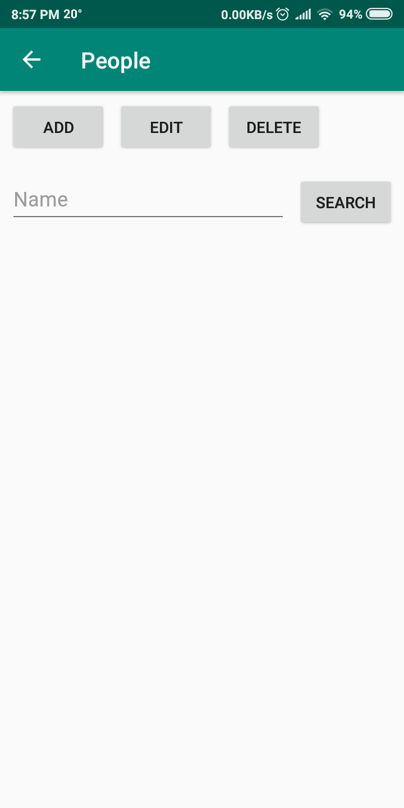

# FilmesSeries
Base de dados de filmes e series

Esta aplicação vai ter na base de dados 5 tabelas: 
&nbsp;&nbsp;&nbsp;&nbsp;-Uma para as informações sobre os filmes e/ou series; 
&nbsp;&nbsp;&nbsp;&nbsp;-uma para as informações sobre as pessoas; 
&nbsp;&nbsp;&nbsp;&nbsp;-uma para os generos; 
&nbsp;&nbsp;&nbsp;&nbsp;-e duas que fazem a relação entre a tabela dos filmes e cada uma das outras duas.
  
 Com o seguinte modelo relacional:
 
 
Esta aplicação serve para ajudar o utilizador a adquirir e gerir uma variedade de informação sobre filmes e series.

Funcionalidades: 
&nbsp;&nbsp;&nbsp;&nbsp;-Adição de novos filmes/series; 
&nbsp;&nbsp;&nbsp;&nbsp;-Adição de novas pessoas(atores/atrizes/etc); 
&nbsp;&nbsp;&nbsp;&nbsp;-Adição de novos generos; 
&nbsp;&nbsp;&nbsp;&nbsp;-Lista de filmes; 
&nbsp;&nbsp;&nbsp;&nbsp;-Lista de series vistas e em que episodio vai o utilizador;

Atividade principal:

Atividade de gestão de filmes e series:

Atividades para adicionar/editar(iguais) e apagar filmes/series:

Atividade de gestão de pessoas:

Atividades para adicionar/editar(iguais) e apagar pessoas:

Atividade de gestão de  generos(como só tem um dado achei melhor usar só uma activity):

Faz tambem a validação dos dados como por exemplo:

